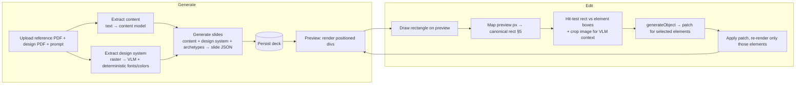

# Dreck = Slide Generator + Editor

Prototype spec for the Drizzle [task](https://petal-echo-01d.notion.site/Training-Materials-3950e2b8170480308d2ace44b3a2f900).

Demo available at: [https://dreck.ryndia.me/](https://dreck.ryndia.me/)

---

## 0. What this is (and what it deliberately isn't)

A single-user prototype: upload a **reference PDF** (content) + a **design PDF** (style) + a text prompt → generate 2–3 landscape slides → preview → draw a rectangle on a slide → AI edits only that region → see the result.

**Cut on purpose**: durable orchestration (Workflows/Inngest), an evals harness + model matrix, pgvector / embedding-based grounding, multi-tenancy / orgs / RLS, immutable version snapshots.

---

## 1. Stack

| Layer               | Choice                                                                                    | Why                                                                                                                         |
| ------------------- | ----------------------------------------------------------------------------------------- | --------------------------------------------------------------------------------------------------------------------------- |
| Framework           | TanStack Start (Router + Start)                                                           | Preferred over Next; server functions cover `generate` + `edit`; official CF Workers target                                 |
| UI                  | React + shadcn/ui + Tailwind                                                              | Editor chrome; slide canvas is plain positioned divs                                                                        |
| Rectangle selection | pointer events on the preview + `getBoundingClientRect`                                   | No library needed; it's one draggable box (§5)                                                                              |
| LLM                 | AI SDK — `streamObject` (generation), `generateObject` (extraction, edits)                | Structured output everywhere; streaming makes slides paint progressively (§4a)                                              |
| Content extraction  | **table-aware** doc-model (Mistral doc API) or VLM structured output — **not** naive text | PI has a text layer, but linear extraction _scrambles the dosing tables_ (row↔dose links lost); doc-model keeps rows intact |
| Style extraction    | rasterize design PDF → VLM, **hybrid** with deterministic fonts/colors (§6)               | Design PDF is visual; but it _has_ a text layer, so fonts/colors are knowable exactly                                       |
| Persistence         | Postgres + Drizzle (small)                                                                | Only two things need to persist: decks and editable prompts                                                                 |
| PDF export          | Browser Rendering / print CSS                                                             | Only if the "download" nicety is wanted;                                                                                    |

---

## 2. Two flows

**Generation is synchronous but optimized for _perceived_ speed** (§4a) — parallel extraction, streamed output, cached style. Speed-to-deck is one of our goals.

---

## 3. The slide model

A slide is JSON: an ordered list of **elements**, each `{ id, role, x, y, w, h, content, styleRef }` in a **canonical coordinate space** (1440×810, matching the design deck's native 16:9 — or 1280×720, either works). The preview renders these as absolutely-positioned divs. The same divs are what a PDF export would print.

This is why we keep the semantic model instead of image inpainting: the brief asks to "keep the rest of the slide unchanged **as much as possible**." With semantic elements, an edit re-renders only the hit elements — the rest is **byte-for-byte unchanged**, not "as much as possible."

---

## 4. Generation

**The split that anchors this:** the reference deck contributes _style + archetypes only_ — never its words ("Regular Strength 325 mg" is discarded). The AI writes **new** content from the reference _PDF_, poured into those archetypes. Style from deck, content from PDF, generated fresh. §4 is entirely about protecting the content half; the style half is §6.

- **Content extraction** → structured content model from the reference PDF only, using table-aware extraction (§1). Structured fields survive end-to-end — notably a typed `dosingTable: { weightBand, dose, interval, maxDaily }[]` so the row <---> dose associations reach generation intact and can't be re-flattened into ambiguous prose. This is also where "content comes only from the PDF" is enforced: the prompt does faithful extraction and forbids outside facts. The user's runtime text prompt (brief step 3) threads in here to steer emphasis.
- **Generate** → content model + design system + selected archetype per slide → slide JSON (positioned elements), constrained to extracted content + design tokens. Output must parse against a fixed Zod schema.
- **Dose-grounding check** (lightweight) -> after generation, pull every number/dose token off the slides and verify each appears in the source PDF text; flag mismatches. Not pgvector — just string/number presence. This specifically guards against the model emitting its _parametric_ knowledge.

---

## 4a. Speed

Speed here is a matter of **code structure and API/model choices, never durable orchestration** — Workflows _add_ checkpoint latency, so they're the wrong tool for a speed goal. Four levers, all cheap:

- **Parallelize extraction.** Content extraction and design-system extraction are independent
- **Stream the output.**
- **Cache the expensive half.** Design-system extraction is fixed per design PDF — extract once, store, reuse
- **Fast models on the hot path.**

---

## 5. Coordinate mapping

**Canonical space.** Every element and every selection rectangle lives in one canonical slide space, e.g. `1440 × 810`. This is the "actual slide" the brief refers to.

**Preview → canonical.** The preview renders the slide scaled to fit its container at factor `s = renderedWidth / 1440` (uniform, aspect-ratio preserved). When the user draws a box:

---

## 6. Design-system extraction

- **Deterministic** (from the PDF): exact fonts and palette, pulled from the text layer + sampled pixels.
- **VLM** (over rasterized pages): the layout archetypes and overall feel, where a model genuinely helps.

Output: `{ tokens, archetypes }` against a fixed schema.

**Four archetypes** the deck provides, clean and distinct:

1. **Title** — navy, diagonal split, eyebrow + wordmark + rule + subtitle + footer
2. **Card grid** — eyebrow + heading + intro + N cards (name / figure / form / use / DIN)
3. **Two-column** — accent-border list (left) + arrow-bullet explainer (right)
4. **Table + sidebar** — label→right-aligned-bold-figure rows + navy callout panel

## 7. References:

- [Paracetamol approved PI](./Paracetamol-Approved-PI-26-Nov-2021.pdf)
- [Pharma Training presentation design](./Pharma_training_presentation_design.pdf)
